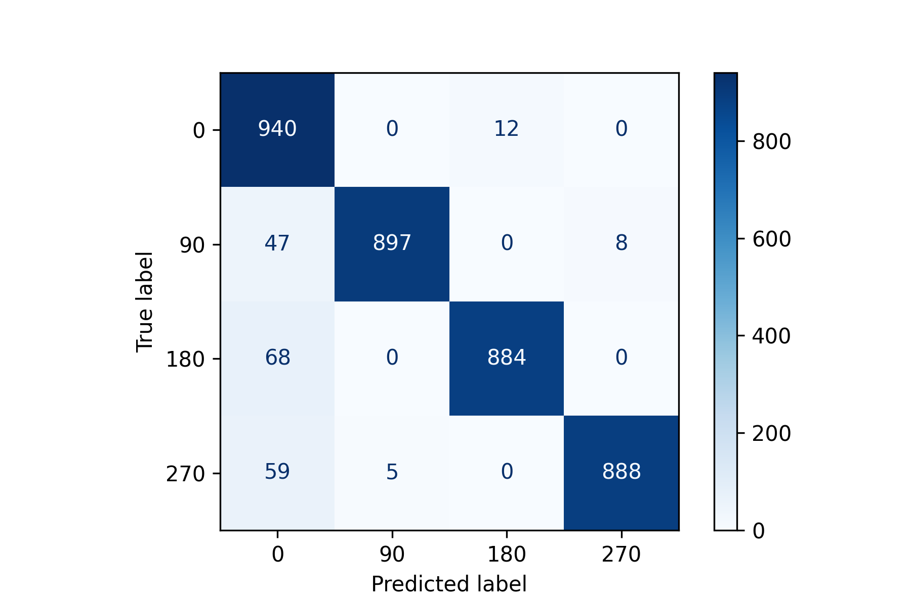

# 문서 회전 분류 모델
- 입력 이미지에 대해서 0, 90, 180, 270 단위의 회전 여부를 분류
- DenseNet201 모델을 학습하여 분류

  

## Requirements 
- tensorflow==2.2.0
- tensorflow-estimator==2.4.0
- tensorflow-gpu==2.4.1
- scikit-image==0.16.2
- scikit-learn @ file:///tmp/build/80754af9/scikit-learn_1598376882706/work
- pandas @ file:///tmp/build/80754af9/pandas_1602088128026/work
- numpy==1.19.5
- matplotlib @ file:///tmp/build/80754af9/matplotlib-base_1603376012865/work
- opencv-python==4.5.1.48
- tqdm==4.19.9
  
  

## 폴더 구조 및 파일 설명
- ./logs : 학습 결과들이 저장되는 폴더
- dataset.csv : 학습 및 테스트 이미지가 저장되어 있는 경로 
- generator_v1.py : balancebatch generator 및 기타 util 함수 들 
- data_builder.ipynb : 데이터 셋 생성
- training.ipynb : 모델 학습 
- prediction.ipynb : 학습 모델을 prediction

  

## 결과

 Confusion Matrix

